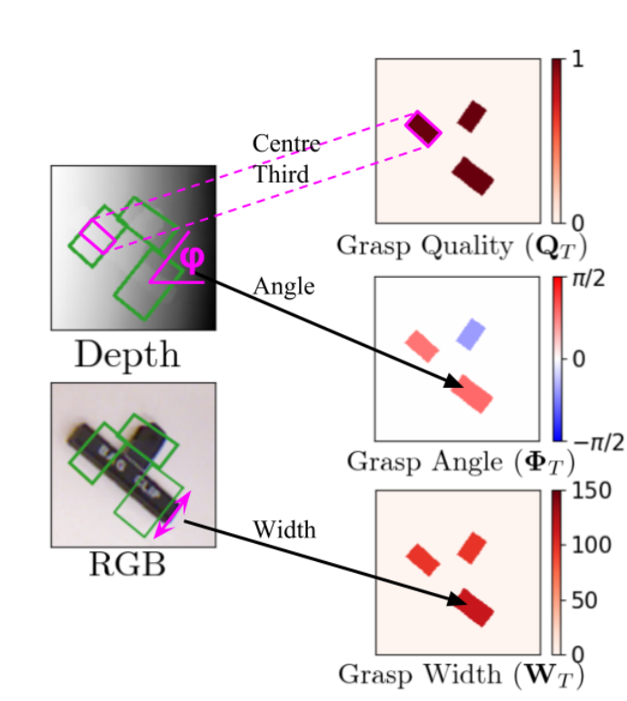
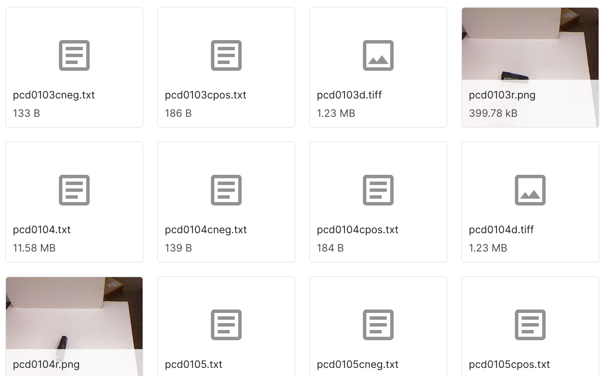

# CLOVER-Lab-CUHK-Assessment

Description
-------
Grasping is an important skill in our daily manipulation tasks. But it is still challenging for robots to grasp in the
unstructured environments in the real world. The goal of this assessment is to predict the quality and pose of
grasps based on vision.   

**Grasp Representation**: Parameterised as a grasp quality, 
angle and gripper width for every pixel in the input image

**Grasp Quality**: Describe the quality of a grasp
executed at each pixel. The value is a scalar in the
range [0, 1] where a value closer to 1 indicates higher grasp
quality, i.e. higher chance of grasp success. 

**Angle**: Describe the angle of a grasp to
be executed at each point. 

**Width**: Describe the gripper width of a grasp
to be executed at each point.

Dataset
-------
We use cornell grasp dataset in this task. The dataset can be found here:
https://www.kaggle.com/datasets/oneoneliu/cornell-grasp

>*pcd\*.txt are point cloud files, pcd\*cneg.txt 
> are negative labels for grasp, 
> pcd\*cpos.txt are positive labels for grasp,
>pcd\*d.tiff are depth images,
>\*.png are raw rgb images.*

The folders '1'-'9' are for training, and
the folder '10' is for testing. To generate the ground truth for training, 
the data processing methods are as follows:

**Grasp Quality**: Each ground-truth positive grasp from 
the Cornell Grasping Dataset as a binary label and set
the corresponding area of Q_T to a value of 1. All other 
pixels are 0.

**Angle**: Compute the angle of each grasping rectangle
in the range [−π/2,π/2].

**Width**: Compute the width in 
pixels (maximum of 150) of each grasping rectangle.

Evaluation
-------
The task includes three parts, and there are some 
subtasks for each part. 
The evaluation will start after one weak. 
Try to finish more subtasks in one weak. 
If there are any problems, please feel free to 
contact me (email: lizhihao@cuhk.edu.cn).

**Data processing**
- [ ] Dataset generation for grasp quality
- [ ] Dataset generation for angle
- [ ] Dataset generation for width
- [ ] Data loader
- [ ] Data argumentation

**Training**
- [ ] Network for grasp quality
- [ ] Network for angle
- [ ] Network for width

**Testing**
- [ ] Evaluate grasp success rate for test set